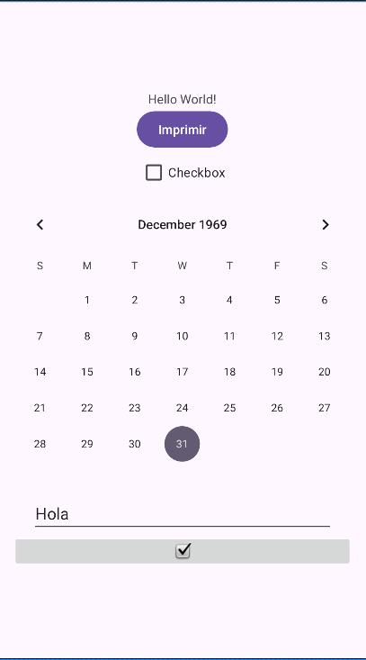
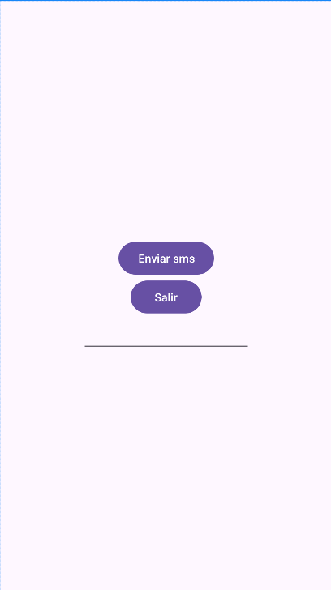

# Lab #1 - Aplicación Android con Java

Este proyecto es una aplicación básica desarrollada en Android Studio utilizando Java. Sus principales características incluyen:

* **Pantalla principal:**

  * Un **calendario** para selección de fechas.
  * Un **campo de texto** para ingresar información.
  * Un **checkbox**, que al marcarlo muestra un mensaje tipo *Toast* con el contenido del campo de texto al presionar el botón "Imprimir", la hora y fecha actual.

* **Segunda pantalla:**

  * Un **campo de texto** para ingresar un número de teléfono.
  * Un botón **"Enviar SMS"**, que abre un chat de WhatsApp con el número ingresado.
  * Un botón **"Regresar"** para volver a la pantalla principal.

Esta aplicación es una introducción al desarrollo en Android, enfocada en el manejo de elementos básicos de la interfaz y la navegación entre actividades.
#Capturas de pantalla

### Pantalla de inicio

### Segunda pantalla

